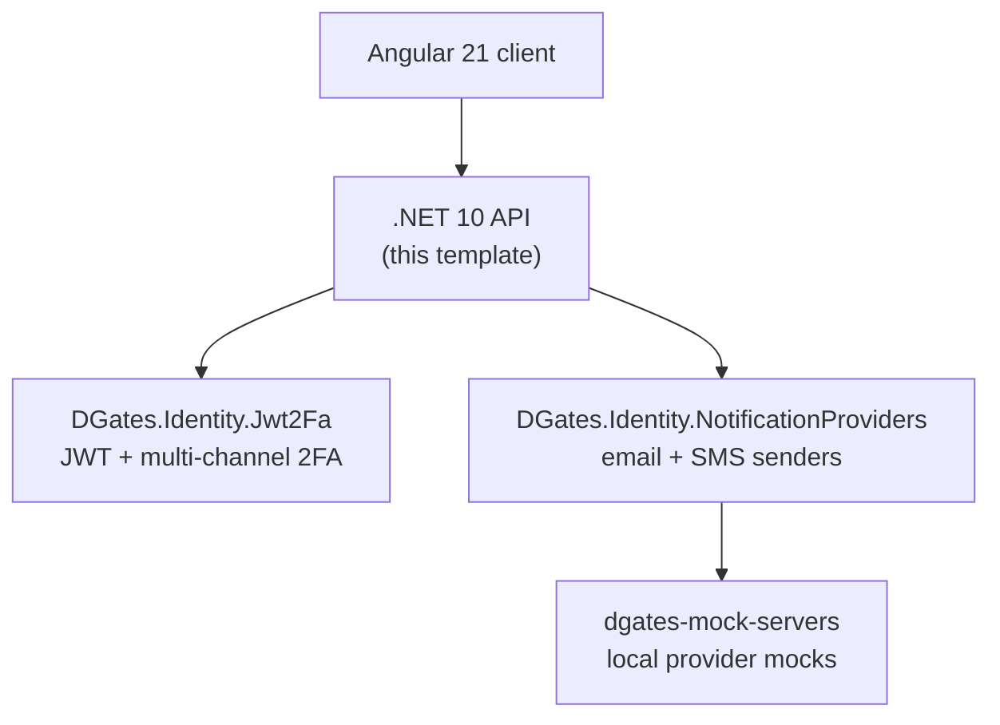

# Angular + .NET Authentication Starter Template

[](https://github.com/dgates82/angular-dotnet-auth-template/actions/workflows/ci.yml)
[](https://sonarcloud.io/summary/new_code?id=dgates82_angular-dotnet-auth-template)
[](https://sonarcloud.io/summary/new_code?id=dgates82_angular-dotnet-auth-template)
[](https://github.com/dgates82/angular-dotnet-auth-template/actions/workflows/codeql.yml)

An Angular 21 + ASP.NET Core 10 authentication starter with JWT auth and multi-channel 2FA (authenticator app, email, SMS). Generate it into your own repository, run the whole stack locally with no external accounts, and try it live first.

> **Try it before you clone it:** [Live demo](https://angular-dotnet-auth-template-1019453023791.us-central1.run.app) · [Use this template](https://github.com/dgates82/angular-dotnet-auth-template/generate)
>
> The demo is this repository, deployed from its tagged releases by its own GitHub Actions pipeline — not a separate showcase app. Register an account and try email confirmation, password reset, authenticator/TOTP enrollment, email and SMS 2FA, and the admin screens. No real email or SMS is sent: messages land in the public mock inboxes — [SendGrid mock](https://sendgrid-mock-7qs7btajdq-uc.a.run.app) (email) and [Twilio mock](https://twilio-mock-1019453023791.us-central1.run.app) (SMS). Both scale to zero, so the first load after idle can take a few seconds. The pipeline that deployed it ships in the template too — see [Deploy your own](#deploy-your-own-cloud-run). ([Read how it's built](https://dev.to/dgates82/an-angular-net-auth-template-with-multi-channel-2fa-and-a-live-demo-2hp4).)


## What you get

**Authentication**
- ASP.NET Core Identity with JWT issuance and claims
- Registration, login, email confirmation
- Password reset (emailed link) and password change (current password required) — separate flows
- Configurable self-registration

**Two-factor**
- Authenticator app (TOTP) with QR code enrollment, email codes, SMS codes
- Recovery codes issued on enrollment
- Optional or required 2FA, and a configurable list of available methods

**Admin**
- User list, create, edit, deactivate, unlock
- Role-based authorization

**Development experience**
- Full Docker Compose stack — MySQL, Mailpit (SMTP), and SendGrid/Twilio/Postmark mocks
- No external accounts needed for any provider

**Quality**
- Playwright end-to-end suite against the real containerized app
- CI on every push and PR, SonarQube Cloud quality gate, CodeQL

**Deployment included**
- A GitHub Actions → Cloud Run pipeline every generated repo inherits
- Workload Identity Federation (no static credentials), secrets in Secret Manager, a free-tier stack — see [Deploy your own](#deploy-your-own-cloud-run)

**Extracted packages**
- Auth and notification logic ship as reusable NuGet packages — see [Built on](#built-on-the-package-ecosystem)

## Who is this for?

Good fit: developers starting an Angular + ASP.NET Core app who want working authentication and 2FA from day one instead of assembling it from snippets; teams that want self-hosted auth, a complete local dev environment, and a codebase they can freely customize.

Not a good fit: teams that want an external identity provider (Auth0, Entra ID, Cognito, etc.) to own the login experience.

This is a starter template, not a finished app.

## Built on: the package ecosystem



This template is the reference application. Auth and notification capabilities are extracted into independently reusable NuGet packages, and fixes reach generated repos through an ordinary package update.

| Project | What it is | Reach for it when |
| --- | --- | --- |
| **angular-dotnet-auth-template** (you are here) | Angular + .NET starter with JWT and 2FA | you want a running, customizable app |
| [DGates.Identity.Jwt2Fa](https://github.com/dgates82/DGates.Identity.Jwt2Fa) ([NuGet](https://www.nuget.org/packages/DGates.Identity.Jwt2Fa)) | JWT issuance and multi-channel 2FA for ASP.NET Core Identity | you have an existing API and want the auth without the template |
| [DGates.Identity.NotificationProviders](https://github.com/dgates82/DGates.Identity.NotificationProviders) ([NuGet](https://www.nuget.org/packages/DGates.Identity.NotificationProviders)) | Email and SMS senders (SendGrid, SMTP, Postmark, Twilio, SNS) | you need swappable notification providers |
| [dgates-mock-servers](https://github.com/dgates82/dgates-mock-servers) | Public GHCR images mocking SendGrid, Twilio, and Postmark | you want to develop or test notification flows with no accounts |

More from dgates82: [DGates.AwsSecretsManager](https://github.com/dgates82/DGates.AwsSecretsManager) and [dotnet-nuget-release-template](https://github.com/dgates82/dotnet-nuget-release-template), the template the two packages above were scaffolded from.

## How to Use This Template

1. Click **[Use this template](https://github.com/dgates82/angular-dotnet-auth-template/generate)** on GitHub to generate your own repository from this one — not a fork, a fresh repo with its own history.
2. Clone *your new repo* locally.
3. Follow [Quickstart](#quickstart) below to confirm it works before changing anything.
4. Work through [Customizing](#customizing) to make it yours.

## Quickstart

Docker-first. From a fresh clone:

```bash
docker compose up -d mysql sendgridmock smsmock

cd api && dotnet tool restore
cd AngularDotNetAuthTemplate.Api
dotnet ef database update
cd ../..

docker compose up -d --build api
```

Browse to `http://localhost:8080`. Mock inboxes: SendGrid at `http://localhost:3040`, SMS at `http://localhost:3030`.

Prerequisites: Docker, and the .NET SDK 10 (for the migration step above — the container doesn't run migrations itself).

Want hot-reload instead, or to run the API and Angular client separately? See [docs/LOCAL_DEV.md](docs/LOCAL_DEV.md).

## Deploy your own (Cloud Run)

The template doesn't just have a demo — it ships the pipeline that deployed it. Every generated repo inherits `.github/workflows/deploy-cloudrun.yml`, the `Dockerfile`, and `docs/DEPLOYMENT.md`, and can run the same stack on Cloud Run: GitHub Actions → Cloud Run, Workload Identity Federation (no static credentials), app secrets in Secret Manager, Aiven free-tier MySQL with automated power-on handling, and the SendGrid/Twilio mocks deployed as their own scale-to-zero services so no paid email/SMS account is needed.

It's inert until you configure it: a generated repo starts with none of the required Actions variables set, so the deploy job just skips on a tag push. Even if the variables were pointed at this project's values, GCP's own Workload Identity Federation trust — scoped to this exact repository — would reject the token.

Setup checklist (see [docs/DEPLOYMENT.md](docs/DEPLOYMENT.md) for exact commands):
1. Enable the needed GCP APIs and create an Artifact Registry repository in your own project
2. Create a Workload Identity pool/provider with the attribute condition scoped to *your* repository
3. Create a deploy service account and grant it access
4. Put the app secrets in Secret Manager
5. Set up MySQL (Aiven free tier or your own) and add its credentials
6. Set the Actions variables and secrets
7. Push a `vX.Y.Z` tag to trigger a deploy

Free-tier ceiling: see [docs/DEPLOYMENT.md](docs/DEPLOYMENT.md#free-tier).

## Customizing

Every spot that needs a look before you ship is marked `TODO(template)` (in code comments) or a literal `[Application Name]` placeholder. Find them all with:

```bash
git grep -n "TODO(template)"
git grep -n "\[Application Name\]" -- api client/src
```

See [docs/CUSTOMIZING.md](docs/CUSTOMIZING.md) for the full list, and [docs/CONFIGURATION.md](docs/CONFIGURATION.md) for JWT, notification provider, database provider, and Angular feature-flag configuration.

### JWT Configuration

**The one thing you must change before deploying:** `Jwt2FaConfig.SecurityKey` in `appsettings.json` ships with an obviously-fake default. See [JWT Configuration](docs/CONFIGURATION.md#jwt-configuration) in `docs/CONFIGURATION.md` for the full shape.

### Database Provider

MySQL is the only provider this template ships with and tests against. See [Database Provider](docs/CONFIGURATION.md#database-provider) in `docs/CONFIGURATION.md` for swapping providers.

## Testing, upgrading, troubleshooting

- **Testing:** the Playwright end-to-end suite runs against the real containerized app — see [Running the End-to-End Suite](docs/LOCAL_DEV.md#running-the-end-to-end-suite) in `docs/LOCAL_DEV.md`.
- **Upgrading:** pre-1.1.0 JWT config migration and Angular's lockstep-versioned dependencies — see [docs/UPGRADING.md](docs/UPGRADING.md).
- **Troubleshooting:** see [Troubleshooting](docs/LOCAL_DEV.md#troubleshooting) in `docs/LOCAL_DEV.md`.

## License

This project is licensed under the MIT License.
